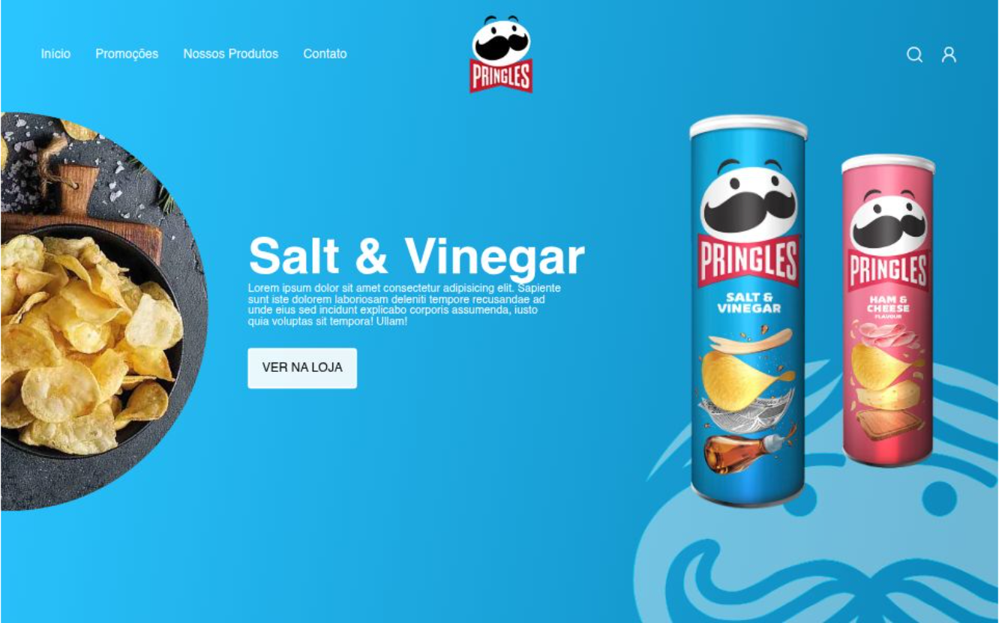

# 🍟 Pringles Landing Page

Projeto desenvolvido para criar uma experiência visual imersiva e interativa para a marca Pringles, explorando animações de alto nível e transições fluidas entre produtos.

## 📸 Preview

<table align="center">
  <tr>
    <td valign="center">
      
    </td>
  </tr>
</table>

🔗 **Demo:** pringles-kappa.vercel.app

---

## ✨ Features

- 🎢 Slider interativo de sabores (Salt & Vinegar, Paprika, etc.)
- 🎭 Animações de texto e elementos dinâmicos com GSAP
- 🎨 Interface moderna e totalmente responsiva

---

## 📦 Como rodar o projeto

Este é um projeto front-end estático. Para visualizá-lo, você pode simplesmente abrir o arquivo `index.html` em seu navegador ou utilizar a extensão **Live Server** no VS Code.

### Clonar o repositório

```bash
git clone https://github.com/mcdcwb/Pringles.git
```

### Entrar na pasta do projeto

```bash
cd Pringles
```

---

## 🚀 Stacks utilizadas:

<div style="display: inline_block">
    
    
    
    
</div>

---

## 📄 Licença

Este projeto está sob a licença MIT.
